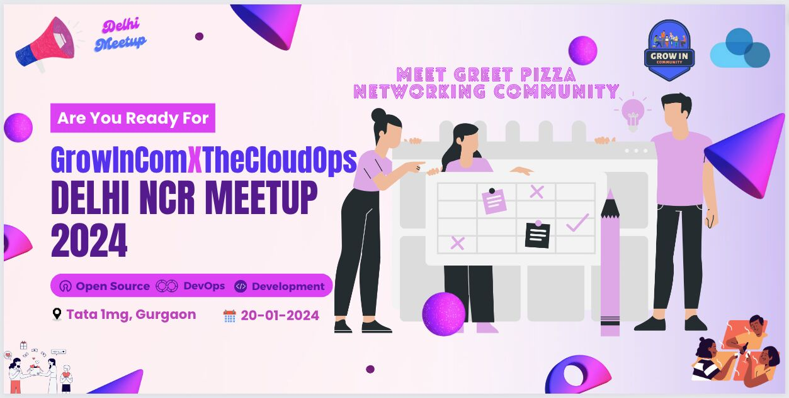

<br/>
<p align="center">

  <a href="https://github.com/Blazity/next-saas-starter" >
    
  </a>

  <h1 align="center">✨ GrowIn x CloudOps Meetup Website Delhi NCR ✨</h1>

  <h3 align="center">
    💖 Enjoy In Person Meetup, GrowIn X CloudOPs Community Engaging Activities, Good food, Good Vibes, Mentorship Sessions. 💖
    <br/>
    <br/>
  </h3>
</p>

<div align="center">

</div>

<a href="https://t.co/DtXtW5SbFb" style="width: 100%; display: flex; justify-content: center;">
  
</a>
<br />

<h4>Run With npm or yarn</h4>

```
# run the dev mode
$ yarn dev

# run the prod mode
yarn start

# build the app
yarn build
```

> Hint: To edit the blog pages go to [/admin](http://localhost:3000/admin) and navigate to a blog page to edit it. To exit editing mode navigate to [/admin/logout](http://localhost:3000/admin/logout)

## 🚀 One click deploy

Clone the repository and one-click deploy to Vercel for free!

[](https://vercel.com/new/git/external?repository-url=https://github.com/Blazity/next-saas-starter)

Clone the repository and one-click deploy to Netlify for free!

[](https://app.netlify.com/start/deploy?repository=https://github.com/Blazity/next-saas-starter)

## 🧰 Built With

- Statically generated pages with [**Next.js** ](https://github.com/vercel/next.js)
- [Styled components](https://github.com/styled-components/styled-components/)
- [MDX](https://github.com/mdx-js/mdx)
- [TypeScript](https://github.com/Microsoft/TypeScript)

## 🤲🏻 Contributing

Contributions are what make the open source community such an amazing place to be learn, inspire, and create. Any contributions you make are **greatly appreciated**.

- If you have suggestions for adding or removing projects, feel free to [open an issue](https://github.com/Blazity/next-saas-starter/issues/new) to discuss it, or directly create a pull request after you edit the _README.md_ file with necessary changes.
- Create individual PR for each suggestion.

### Creating A Pull Request

1. Fork the Project
2. Create your Feature Branch (`git checkout -b feature/AmazingFeature`)
3. Commit your Changes (`git commit -m 'Add some AmazingFeature'`)
4. Push to the Branch (`git push origin feature/AmazingFeature`)
5. Open a Pull Request

## 😎 Acknowledgements

Big thanks to authors of these libraries:

- https://github.com/neg4n/next-api-og-image - generating open graph images
- https://github.com/blazity/nextjs-color-mode - non-flickering dark mode
- https://github.com/Brew-Brew/css-in-js-media - a convenient way of creating media queries

## Support

If you're looking for help or simply want to share your thoughts about the project, we encourage you to join our Discord community. Here's the link: [https://blazity.com/discord](https://blazity.com/discord). It's a space where we exchange ideas and help one another. Everyone's input is appreciated, and we look forward to welcoming you.

## ✨ Contributors

Thanks goes to these wonderful people ([emoji key](https://allcontributors.org/docs/en/emoji-key)):

<!-- ALL-CONTRIBUTORS-LIST:START - Do not remove or modify this section -->
<!-- prettier-ignore-start -->
<!-- markdownlint-disable -->
<table>
  <tr>
    <td align="center"><a href="https://bstefanski.com/"><br /><sub><b>Bart Stefanski</b></sub></a><br /><a href="https://github.com/Blazity/next-saas-starter/commits?author=bmstefanski" title="Code">💻</a></td>
    <td align="center"><a href="https://github.com/ilasota"><br /><sub><b>Igor Lasota</b></sub></a><br /><a href="https://github.com/Blazity/next-saas-starter/commits?author=ilasota" title="Code">💻</a></td>
    <td align="center"><a href="https://github.com/jbryn"><br /><sub><b>Jan Bryński</b></sub></a><br /><a href="https://github.com/Blazity/next-saas-starter/commits?author=jbryn" title="Code">💻</a></td>
    <td align="center"><a href="https://www.logana.dev/"><br /><sub><b>Logan Anderson</b></sub></a><br /><a href="https://github.com/Blazity/next-saas-starter/commits?author=logan-anderson" title="Code">💻</a> <a href="https://github.com/Blazity/next-saas-starter/commits?author=logan-anderson" title="Documentation">📖</a> <a href="#mentoring-logan-anderson" title="Mentoring">🧑‍🏫</a></td>
  </tr>
</table>

<!-- markdownlint-restore -->
<!-- prettier-ignore-end -->

<!-- ALL-CONTRIBUTORS-LIST:END -->

This project follows the [all-contributors](https://github.com/all-contributors/all-contributors) specification. Contributions of any kind welcome!

## 📝 License

Distributed under the MIT License. See [LICENSE](https://github.com/Blazity/next-saas-starter/blob/main/LICENSE.md) for more information.
